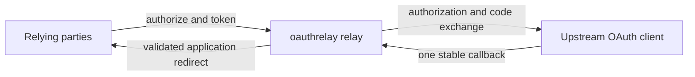

# oauthrelay

`oauthrelay` gives an external OAuth/OIDC client one stable callback and safely relays authorization
results to an explicit set of application origins. It is an embeddable Axum router and a standalone
server for native, container, and AWS Lambda deployments.

An **upstream** represents one provider OAuth client, its credentials, and its stable callback. A
**relay** references that upstream and defines downstream authentication, scopes, and redirect
policy. Several relays can share one upstream without adding provider callbacks.



## Trust model

oauthrelay returns the upstream token response unchanged. The relying party continues to
trust the upstream issuer, JWKS, audience, and UserInfo endpoint while routing authorization and
token requests through oauthrelay. This requires a relying party that supports manual endpoint
configuration; Amazon Cognito is one example.

## Capabilities

- Authorization-code flow with independent upstream S256 PKCE.
- Public, shared-secret, upstream-client, and RFC 7523 `private_key_jwt` relay authentication.
- Exact URI, HTTPS-origin, and variable-port loopback redirect policies with sealed state/code envelopes.
- Transparent authorization, token, refresh, discovery metadata, and JWKS routing.
- Relay-specific exact matching of verified upstream ID-token claims.
- Multi-document File configuration with local or AWS-backed secret references.
- Namespaced Kubernetes custom resources, live watches, and Kubernetes Secret references.
- AWS SSM resource discovery with SSM `SecureString` and Secrets Manager `jsonKey` references.
- Invocation-driven Lambda configuration refresh with a 60-second default TTL.
- Multi-architecture images at `ghcr.io/rise-deploy/oauthrelay`.

## Documentation

- [Getting started](https://rise-deploy.github.io/oauthrelay/getting-started/)
- [Relay trust model](https://rise-deploy.github.io/oauthrelay/relay-model/)
- [Cognito relay to Google](https://rise-deploy.github.io/oauthrelay/guides/cognito-google-relay/)
- [Configuration reference](https://rise-deploy.github.io/oauthrelay/configuration/)
- [File provider](https://rise-deploy.github.io/oauthrelay/reference/file-provider/)
- [Kubernetes provider](https://rise-deploy.github.io/oauthrelay/reference/kubernetes-provider/)
- [AWS SSM provider](https://rise-deploy.github.io/oauthrelay/reference/ssm-provider/)
- [Runtime and deployment](https://rise-deploy.github.io/oauthrelay/reference/runtime/)
- [HTTP endpoints](https://rise-deploy.github.io/oauthrelay/reference/http-endpoints/)

The executable publishes its configuration contract directly:

```console
oauthrelay schema > oauthrelay.schema.json
oauthrelay crds > oauthrelay.crds.yaml
```

## Development

[mise](https://mise.jdx.dev/) installs the pinned Rust, Node.js, and validation tools:

```console
mise install
mise run check
mise run e2e
mise run kubernetes:test
```

Serve the documentation locally with:

```console
mise run docs:serve
```

The regular test suite uses in-process OAuth/OIDC fixtures. `mise run e2e` runs the standalone
binary through a complete authorization-code and refresh flow against a pinned Dex container. No
test contacts Google or Amazon Cognito. `mise run kubernetes:test` validates generated CRDs and
namespace-scoped configuration watches in a disposable Kind cluster.

The workspace contains:

```text
crates/oauthrelay-core/          protocol engine and embeddable router
crates/oauthrelay-secret-resolver/ shared inline, environment, file, and cloud secret dispatch
crates/oauthrelay-provider-file/ File configuration provider
crates/oauthrelay-provider-ssm/  AWS SSM and Secrets Manager provider
crates/oauthrelay-provider-kubernetes/ Namespaced Kubernetes provider
crates/oauthrelay/               standalone native and Lambda runtime
```

The core exposes resolver and replay-cache seams for hosts that need database-backed configuration
or distributed single-use authorization codes.
